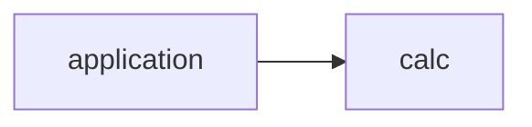
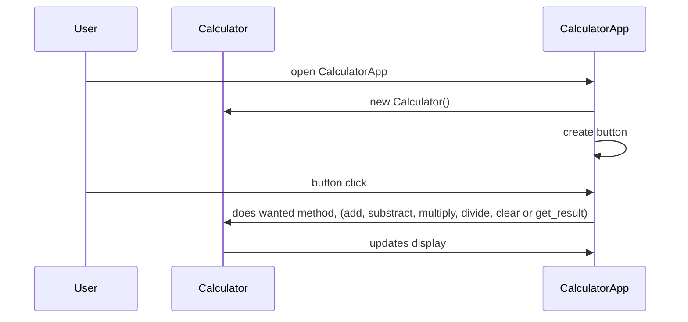

# Arkkitehtuurikuvaus

## Rakenne

Koodin pakkausrakenne:

Pakkaus application sisältää laskimen käyttöliittymän ja pakkaus calc laskimen sovelluslogiikan.

## Sovelluslogiikka

Laskin muodostuu kahdesta luokasta [Calculator](calculator/src/calc/calculator.py) ja [CalculatorApp](calculator/src/application/calculator_app.py):

