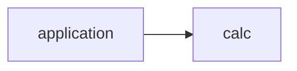
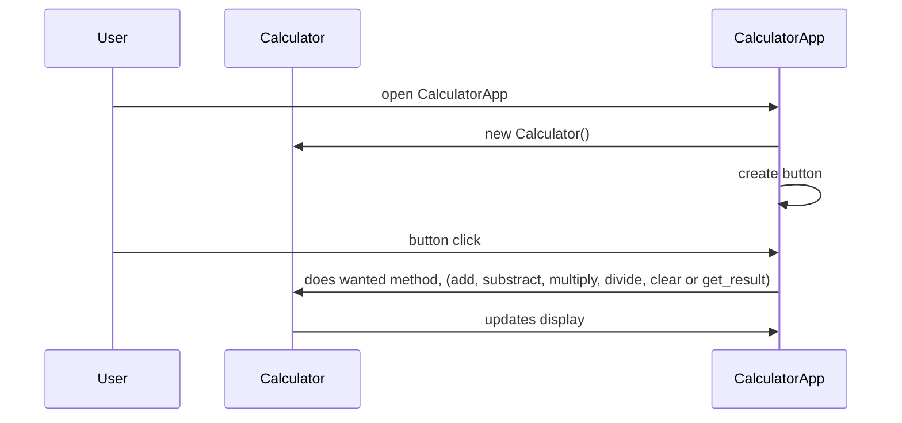

# Arkkitehtuurikuvaus

## Rakenne

Koodin pakkausrakenne:

Pakkaus application sisältää laskimen käyttöliittymän ja pakkaus calc laskimen sovelluslogiikan.

## Käyttöliittymä

Laskimen ainoasta näkymästä vastaa [CalculatorApp](calculator/src/application/calculator_app.py)-luokka. Luokka luo uuden Calculator-objektin ja määrittää graafisen käyttöliittymän (GUI). Graafinen käyttöliittymä määritellään käyttäen "tkinter" kirjaston "Tk" luokkaa, joka luo sovelluksen pääikkunan (laskimen).

CalculatorAppin metodi "create_button" luo laskimen painikkeet, jotka ovat jokainen määritelty sanakirjoissaan. Painikkeiden sanakirjat ovat taas yhdessä listassa nimeltä "buttons". Metodi iteroi listan läpi for loopin avulla ja luo "Button"-objektin jokaiselle painikkeelle. Painikkeen sijainti sovelluksen ikkunassa määritellään "grid"-metodin avulla.

Luokan metodi "button_click" määrittelee jokaisen painikkeen toiminnallisuuden. Metodi tarkistaa, mitä näppäintä on painettu "text" parametrin avulla ja suorittaa sen perusteella halutun if/elif ehdon:

* Kun parametri "text" on "C", laskin tyhjennetään.
* Kun parametri "text" on "=", laskin suorittaa operaation joka oli valittu aikaisemmin ja näyttää vastauksen laskimen tekstikentässä.
* Kun parametri "text" on jokin seuraavista (+, -, * tai /), edellinen lasku (jos on edellinen) suoritetaan, uusi operaattori määritellään ja laskimen tekstikenttä tyhjennetään.
* Kun parametri "text" on jokin numero, numero lisätään tekstikenttään.

## Sovelluslogiikka

Sovelluksen looginen tietomalli muodostuu luokan [Calculator](calculator/src/calc/calculator.py) avulla. Luokka tarjoaa käyttöliittymälle metodit, joiden avulla voidaan laskea haluttu lasku, tyhjentää tekstikenttä ja saada laskun vastaus. Luokan metodit:

* add(num)
* substract(num)
* multiply(num)
* divide(num)
* clear()
* get_result()

## Päätoiminnallisuus

Seuraava sekvenssikaavio näyttää Userin, Calculatorin ja CalculatorAppin keskeisen vuorovaikutuksen. Käyttäjä avaa sovelluksen:

`CalculatorApp` luo uuden `Calculator` objektin. `CalculatorApp` luo sovelluksen painikkeet, joita sovelluksen käyttäjä voi painaa. Käyttäjä voi painaa haluamiaan laskimen painikkeita. Riippuen, mitä käyttäjä painaa, niin `CalculatorApp` kutsuu `Calculatorin` haluttua metodia. `Calculator` suorittaa halutun metodin ja `CalculatorApp` päivittää halutun näkymän.