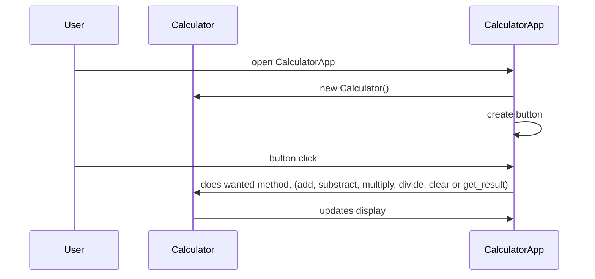

## Sovelluslogiikka

```mermaid
sequenceDiagram
    participant User
    participant Calculator
    participant CalculatorApp
    User ->> CalculatorApp: open CalculatorApp
    CalculatorApp ->> Calculator: new Calculator()
    CalculatorApp ->> CalculatorApp: create button
    User ->> CalculatorApp: button click
    CalculatorApp ->> Calculator: does wanted method, (add, substract, multiply, divide, clear or get_result) 
    Calculator ->> CalculatorApp: updates display
  
```