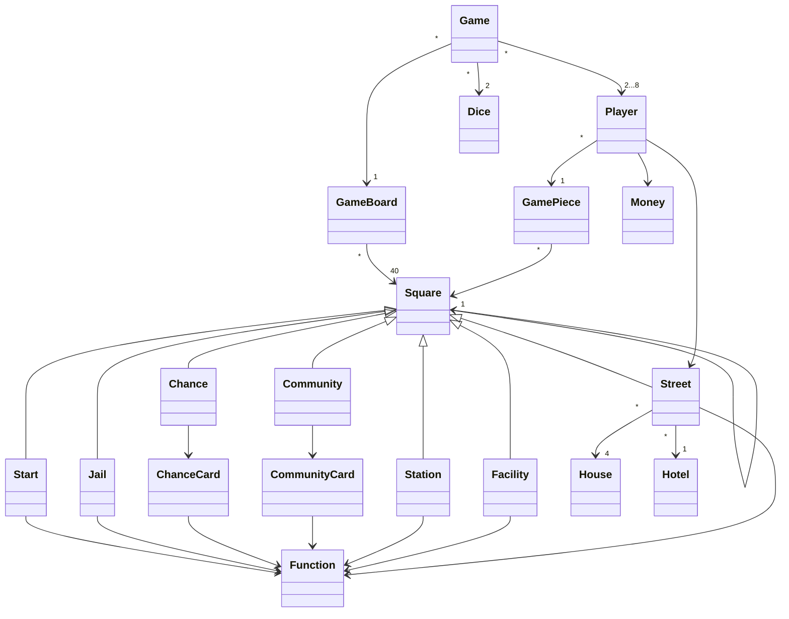

## Sovelluslogiikka

```mermaid
classDiagram
    Game "*" --> "1" GameBoard
    Game "*" --> "2...8" Player
    Game "*" --> "2" Dice
    Player "*" --> "1" GamePiece
    GameBoard "*" --> "40" Square
    GamePiece "*" --> "1" Square
    Square --> Square
    Square <|-- Start
    Square <|-- Jail
    Square <|-- Chance
    Square <|-- Community
    Square <|-- Station
    Square <|-- Facility
    Square <|-- Street

    Start --> Function
    Jail --> Function
    Chance --> ChanceCard
    ChanceCard --> Function
    Community --> CommunityCard
    CommunityCard --> Function
    Station --> Function
    Facility --> Function
    Street --> Function
    Street "*" --> "4" House
    Street "*" --> "1" Hotel
    Player --> Street
    Player --> Money


    class Game {

    }

    class GameBoard {
        
    }

    class Dice {

    }

    class Player {
    
    }

    class Square {

    }

    class GamePiece {

    }

    class Start {
        
    }

    class Jail {

    }

    class Chance {

    }

    class Community {

    }

    class Station {

    }

    class Facility {

    }

    class Street {

    }

    class Money {
        
    }

```
