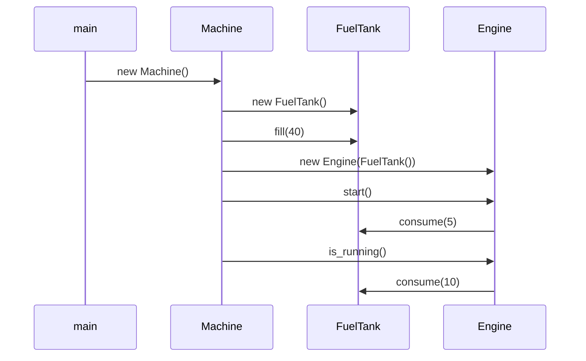

```mermaid
sequenceDiagram
    participant main
    participant Machine
    participant FuelTank
    participant Engine
    main ->> Machine: new Machine()
    Machine ->> FuelTank: new FuelTank() 
    Machine ->> FuelTank: fill(40)
    Machine ->> Engine: new Engine(FuelTank())
    Machine ->> Engine: start()
    Engine ->> FuelTank: consume(5)
    Machine ->> Engine: is_running()
    Engine ->> FuelTank: consume(10)

```