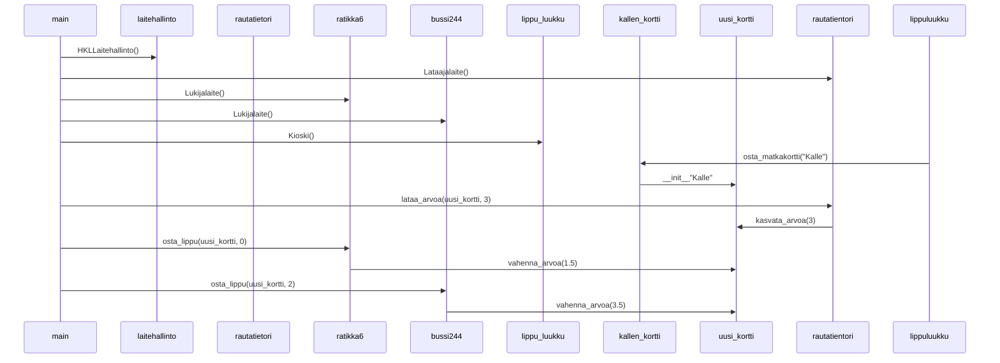

```mermaid
sequenceDiagram
    participant main
    participant laitehallinto
    participant rautatietori
    participant ratikka6
    participant bussi244
    participant lippu_luukku
    participant kallen_kortti
    participant uusi_kortti

    main ->> laitehallinto: HKLLaitehallinto()
    main ->> rautatientori: Lataajalaite()
    main ->> ratikka6: Lukijalaite()
    main ->> bussi244: Lukijalaite()
    main ->> lippu_luukku: Kioski()

    lippuluukku ->> kallen_kortti: osta_matkakortti("Kalle")
    kallen_kortti ->> uusi_kortti: __init__"Kalle"

    main ->> rautatientori: lataa_arvoa(uusi_kortti, 3)
    rautatientori ->> uusi_kortti: kasvata_arvoa(3)

    main ->> ratikka6: osta_lippu(uusi_kortti, 0)
    ratikka6 ->> uusi_kortti: vahenna_arvoa(1.5)
    
    main ->> bussi244: osta_lippu(uusi_kortti, 2)
    bussi244 ->> uusi_kortti: vahenna_arvoa(3.5)


```